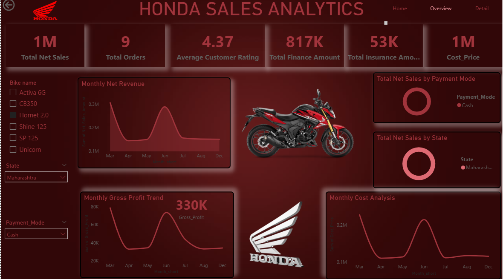

# 🚀 Honda Sales Data Analysis Dashboard (Power BI)


---

## 📊 Project Overview

This project analyzes **Honda motorcycle sales data** using **Power BI** to generate meaningful business insights.  
The dashboard provides an interactive view of **sales performance, financial metrics, insurance revenue, customer satisfaction, and profitability trends**.

The goal of this project is to demonstrate **data visualization, KPI analysis, and business intelligence skills**.

---

## 🖥 Dashboard Preview



---

## 📈 Key Dashboard Metrics

The dashboard includes several important KPIs:

- Total Finance Amount  
- Total Insurance Amount  
- Gross Profit Analysis  
- Average Customer Rating  
- Total Orders  
- Monthly Sales Trends  

---

## 📊 Visualizations Included

The Power BI dashboard contains multiple visual components such as:

- KPI Cards  
- Monthly Sales Trend Line Chart  
- Gross Profit Analysis  
- Customer Rating Distribution  
- Finance Amount Analysis  
- Insurance Revenue Insights  
- Product-wise Order Count  

---

## 🧠 Business Insights Generated

Using this dashboard, businesses can:

- Identify **high-performing products**
- Monitor **monthly sales performance**
- Analyze **customer satisfaction trends**
- Track **finance and insurance revenue streams**
- Evaluate **profitability across different models**

---

## 🛠 Tools & Technologies

- Power BI Desktop  
- CSV / Excel Dataset  
- Data Modeling  
- Business Intelligence  
- Data Visualization  

---

## 📂 Project Structure

```
honda-sales-powerbi-dashboard
│
├── data
│   ├── Honda_All_Dataset.csv
│   └── powerbi_bike_images_dataset.csv
│
├── dashboard
│   └── Honda_sales.pbix
│
├── reports
│   └── Honda_Sales_Report.pdf
│
├── media
│   ├── honda_sales_SS.png
│   └── Honda_Sales.mp4
│
└── README.md
```

---

## 🚀 How to Run the Project

Clone the repository:

```
git clone https://github.com/YOURUSERNAME/honda-sales-powerbi-dashboard.git
```

Open the `.pbix` file in **Power BI Desktop** and explore the interactive dashboard.

---

## 🎯 Skills Demonstrated

- Data Cleaning  
- Data Transformation  
- KPI Development  
- Business Intelligence  
- Dashboard Design  
- Data Storytelling  

---

## 👨‍💻 Author

**Prajwal Sandip Shelar**  
B.E. Artificial Intelligence & Data Science  
Aspiring Data Analyst  

---

⭐ If you like this project, consider giving it a **star on GitHub**.
